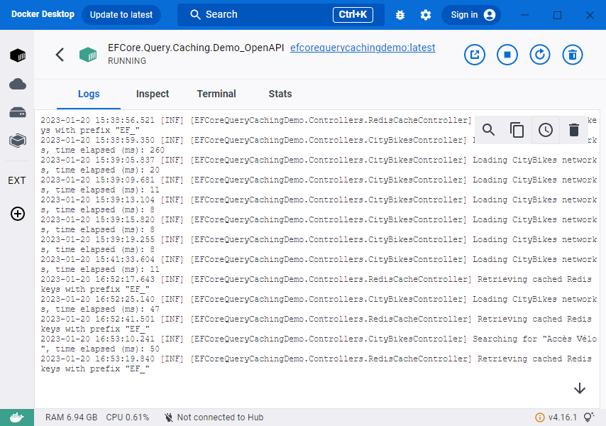

# Boost EF Core performances using distributed cache

# EF Core

Entity Framework Core is a popular lightweight, open-source, cross-platform, object-relational mapping framework for .NET by Microsoft.
It enables you to work with relational data through domain objects. It is being widely used frequently in high transaction applications where performance and scalability are critical.
But in most high transaction scenarios the database quickly becomes a bottleneck. This is because unlike the application tier where you can add more application servers as you need to scale,
you cannot do the same with the database tier.

# A problem

Typically, we might write a memory cache which supports the calling method cache the entity in memory instead of querying it every time from the database.
But doing so requires a lot of additional work. We have to to manually handle the entity query event and clear the cache every time the entity has been changed or deleted.
This requires a lot of work and changes to our code.

# How can we cache each query and flush the cache every time we know it's updated?

The only way to achieve this is with usage of distributed cache library like **[EasyCache.Redis](https://easycaching.readthedocs.io/en/latest/Redis/)**. It is a Redis caching lib which is based on **[EasyCaching.Core](https://github.com/dotnetcore/EasyCaching)** and **[StackExchange.Redis](https://stackexchange.github.io/StackExchange.Redis/)**.
**[EasyCache.Redis](https://easycaching.readthedocs.io/en/latest/Redis/)** is an extremely fast and scalable distributed cache and it lets you cache application data, reduce those expensive database trips,
and improve your application performance and scalability.

# What if our app is running in multiple instances?

Database change by other instances may not apply to other instances and may cause many issues. How can we keep our app available for scale?
By using **[Redis](https://redis.io/docs/about/)** to store our cache! **[Redis](https://redis.io/docs/about/)** is an open source, in-memory data structure store, used as a database, cache and message broker.
It supports data structures such as strings, hashes, lists, sets, sorted sets with range queries, bitmaps, hyperloglogs,
geospatial indexes with radius queries and streams. **[Redis](https://redis.io/docs/about/)** has built-in replication, Lua scripting, LRU eviction, transactions and different levels of on-disk persistence,
and provides high availability via **[Redis Sentinel](https://redis.io/docs/management/sentinel/)** and automatic partitioning with **[Redis Cluster](https://redis.io/docs/management/scaling/)**.

# Implementation

We have to add **AddEFSecondLevelCache** and **EasyCaching** middleware with second level cache interceptor to the ServiceCollection:

```csharp
public void ConfigureServices(IServiceCollection services)
{
    ...

	// Add EFCoreSecondLevelCache Interceptor
	services.AddEFSecondLevelCache(options =>
	{
		// Use EasyCachingCoreProvider as cache provider
		options.UseEasyCachingCoreProvider(ProviderName, isHybridCache: false)
			.DisableLogging(true) // Set it to true for maximum performance
			.UseCacheKeyPrefix("EF_"); // Redis cache key prefix

		// Puts the whole system in cache. In this case calling the 'Cacheable()' methods won't be necessary.
		// If you specify the 'Cacheable()' method, its setting will override this global setting.
		// If you want to exclude some queries from this global cache, apply the 'NotCacheable()' method to them.
		// https://github.com/VahidN/EFCoreSecondLevelCacheInterceptor
		var timeOutMs = EnvironmentVariableProvider.GetSetting<int>(
			"EasyCachingConfig__ExpirationTimeoutMs", easyCachingConfig.ExpirationTimeoutMs);
		options.CacheAllQueries(CacheExpirationMode.Sliding, TimeSpan.FromMilliseconds(timeOutMs));
	});

	// More info: https://easycaching.readthedocs.io/en/latest/Redis/
	services.AddEasyCaching(options =>
	{
		// Uses the Redis cache provider
		options.UseRedis(config =>
		{
			config.DBConfig = new RedisDBOptions()
			{
				Password = EnvironmentVariableProvider.GetSetting<string>(
					"EasyCachingConfig__DbConfig_Password", easyCachingConfig.DbConfig_Password),
				IsSsl = EnvironmentVariableProvider.GetSetting<bool>("EasyCachingConfig__DbConfig_IsSsl",
					easyCachingConfig.DbConfig_IsSsl),
				SslHost = EnvironmentVariableProvider.GetSetting<string>("EasyCachingConfig__DbConfig_SslHost",
					easyCachingConfig.DbConfig_SslHost),
				ConnectionTimeout = EnvironmentVariableProvider.GetSetting<int>(
					"EasyCachingConfig__ConnectionTimeout", easyCachingConfig.DbConfig_ConnectionTimeout),
				AllowAdmin = EnvironmentVariableProvider.GetSetting<bool>(
					"EasyCachingConfig__DbConfig_AllowAdmin", easyCachingConfig.DbConfig_AllowAdmin),
				Database = 0
			};
			config.DBConfig.Endpoints.Add(new ServerEndPoint(
				EnvironmentVariableProvider.GetSetting<string>("EasyCachingConfig__DbConfig_Endpoint",
					easyCachingConfig.DbConfig_Endpoint),
				EnvironmentVariableProvider.GetSetting<int>("EasyCachingConfig__DbConfig_Port",
					easyCachingConfig.DbConfig_Port)));
			config.MaxRdSecond = EnvironmentVariableProvider.GetSetting<int>("EasyCachingConfig__MaxRdSecond",
				easyCachingConfig.MaxRdSecond);
			config.EnableLogging =
				EnvironmentVariableProvider.GetSetting<bool>("EasyCachingConfig__EnableLogging",
					easyCachingConfig.EnableLogging);
			config.LockMs =
				EnvironmentVariableProvider.GetSetting<int>("EasyCachingConfig__LockMs",
					easyCachingConfig.LockMs);
			config.SleepMs =
				EnvironmentVariableProvider.GetSetting<int>("EasyCachingConfig__SleepMs",
					easyCachingConfig.SleepMs);
			config.CacheNulls = EnvironmentVariableProvider.GetSetting<bool>(
				"EasyCachingConfig__CacheNulls", easyCachingConfig.CacheNulls);
			config.SerializerName = SerializerName;
		}, ProviderName)
		.WithMessagePack(opt =>
		{
			opt.EnableCustomResolver = true;
			opt.CustomResolvers = CompositeResolver.Create(
				new IMessagePackFormatter[]
				{
					DbNullFormatter.Instance
				},
				new IFormatterResolver[]
				{
					NativeDateTimeResolver.Instance,
					ContractlessStandardResolver.Instance,
					StandardResolverAllowPrivate.Instance
				});
		}, SerializerName);
	});

	var mySqlConnectionString = EnvironmentVariableProvider.GetSetting<string>("ServiceConfig__MySqlConnectionString", serviceConfig.MySqlConnectionString);

	// Registers the given database context as a service
	services.AddDbContextPool<DataContext>((provider, options) =>
	{
		options.UseMySql(mySqlConnectionString, ServerVersion.AutoDetect(mySqlConnectionString), opt =>
		{
			opt.CommandTimeout((int)TimeSpan.FromSeconds(60).TotalSeconds);
			opt.EnableRetryOnFailure(5, TimeSpan.FromSeconds(30), null);
		});
		// Add second level cache interceptor
		options.AddInterceptors(provider.GetRequiredService<SecondLevelCacheInterceptor>());
	});

    ...
}
```

Redis cache is updated when an entity is changed (insert, update, or delete) via a DbContext that uses this library.
**And you don't have to change any other code!**

**Warning: if the database is updated through a stored procedure or trigger, the cache becomes stale!**

# Run the solution from Docker

To execute compose file, open Powershell, and navigate to the compose file in the solution's root folder.
Then execute the following command: **docker-compose up -d --build --remove-orphans**. To check all running Containers use **docker ps**.


Navigating to **[http://localhost:9400/swagger/index.html](http://localhost:9400/swagger/index.html)** opens Swagger UI with API v1 (you can open it from Docker container too).


By default cache expiration timeout is set to 300000 (5 minutes).



# Conclusion
The executed queries complete much faster since they are cached. With a small tweak to the code, we achieved a big performance boost!

Enjoy!

- [Visual Studio](https://www.visualstudio.com/vs/community) 2022 17.4.3 or greater
- [.NET SDK 6.0](https://dotnet.microsoft.com/en-us/download/dotnet/6.0)
- [Docker](https://www.docker.com/resources/what-container)

## Tags & Technologies
- [.NET 6.0](https://github.com/dotnet/core/blob/main/release-notes/6.0/6.0.9/6.0.9.md)
- [Docker](https://www.docker.com/resources/what-container)  
- [ASP.NET Core 6.0](https://learn.microsoft.com/en-us/aspnet/core/release-notes/aspnetcore-6.0?view=aspnetcore-6.0)
- [CityBikes API Documentation](https://api.citybik.es/v2/)
- [MySQL](https://www.mysql.com/)
- [EasyCaching](https://github.com/dotnetcore/EasyCaching)
- [MessagePack](https://github.com/neuecc/MessagePack-CSharp)
- [EF Core Second Level Cache Interceptor](https://github.com/VahidN/EFCoreSecondLevelCacheInterceptor)
- [StackExchange.Redis](https://stackexchange.github.io/StackExchange.Redis/)

## Licence
Licenced under [MIT](http://opensource.org/licenses/mit-license.php).
Contact me on [LinkedIn](https://si.linkedin.com/in/matjazbravc).
